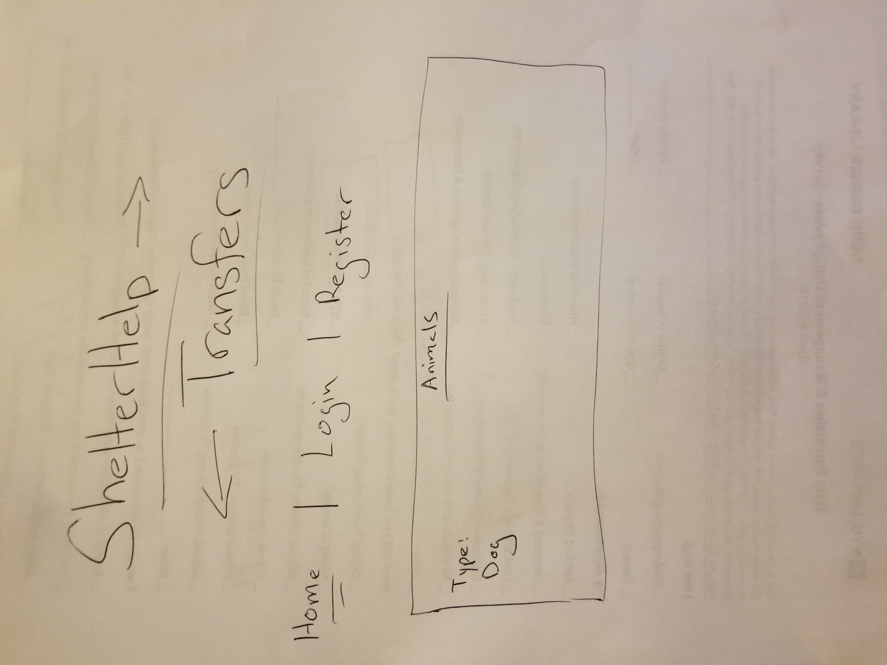
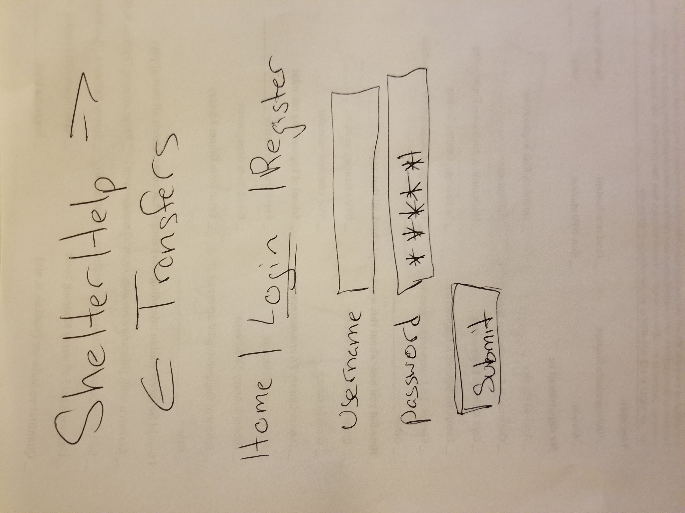
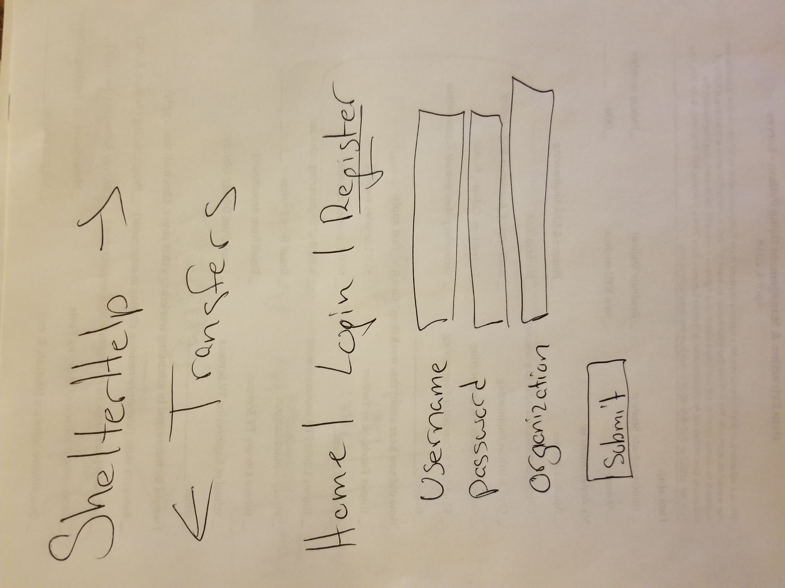
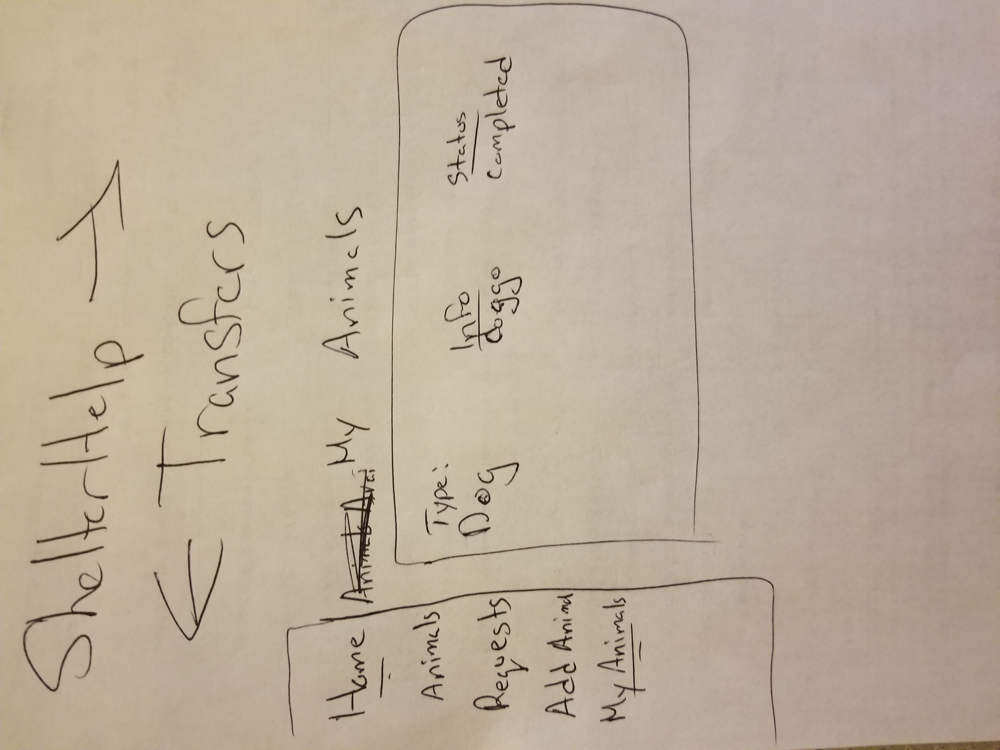
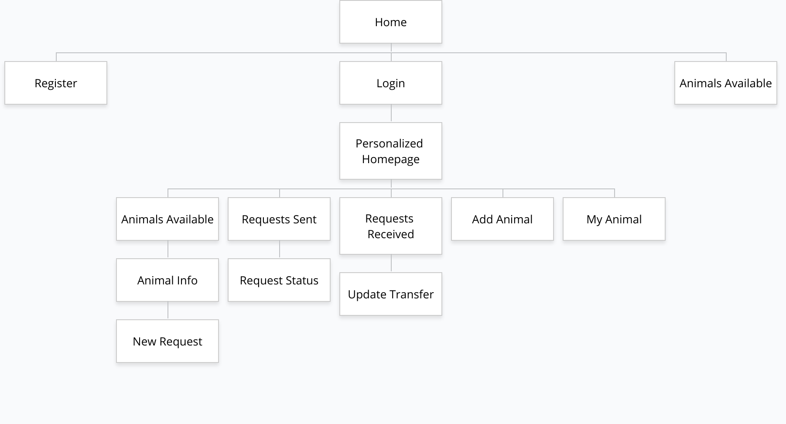

# ShelterHelp Transfers
## Overview

Animals in shelters get put down in high numbers due to over-crowdedness. To a point where an animal shelter in Chicago put down 80% of animals(incoming) in 2013. There is an app in-development (by me using Python/Flask) which will have animal shelter databases to show details of animals and make transfer requests. 

"ShelterHelp Transfers" is a platform for shelters monitor and exchange animals. The Users are organizations that can register and login. Once they're logged in, they can add an animal they are initiating the transfer of, or just have one up available for transfer. Another organization can send a message via form requesting the animal. From there, the owner organization can then check their requests for the animal and decide to begin the transfer.

## Data Model

* Users/Organizations have a list of completed and pending transfers (embedded)
* Animals have a User/Organization (embedded) and a list of details (breed color etc ,referenced) and status (embedded)
* Requests have an Animal (embedded) and an User/Organization (referenced)


An Example User/Organization:

```javascript
{
  username: String,
  organization: String,
  password: String,
  completedRequests: [{
    type: mongoose.Schema.Types.ObjectId,
    ref: "Request"
  }],
  pendingRequests: [{
    type: mongoose.Schema.Types.ObjectId,
    ref: "Request"
  }],
  myAnimals: [{
    type: mongoose.Schema.Types.ObjectId,
    ref: "Animal"
  }]
}
```

An Example Request:

```javascript
{
  user: {
    type: mongoose.Schema.Types.ObjectId,
    ref: "User"
  },
  message: String,
  requestID: String,
  transferred: Boolean,
  animal: {
    type: mongoose.Schema.Types.ObjectId,
    ref: "Animal"
  }
}

```

An Example Animal:

```javascript
{
  user: {
    type: mongoose.Schema.Types.ObjectId,
    ref: "User"
  },
  name: String,
  description: String,
  animalID: String
}
```


## [Link to Commented First Draft Schema](db.js) 

## Wireframes

/ - unregistered homepage



/login - login page



/register - registration page



/home - page for showing logged in home



## Site map

.

## User Stories or Use Cases

1. as non-registered user, I can: 
  a. Register a new account with the site
  b. View Animal names //not details
2. as a user, I can log in to the site
3. as a user, I can add an animal
4. as a user, I can view all of the animals I've created in a single list
5. as a user, I can add animals to the system
6. as a user, I can send/view requests 
7. as a user, I can update/view requests
8. as a user, I can view animal details

## Research Topics

* Perform client side form validation using a JavaScript library
  -Plan on using passport.js because it's most popular on search engines
* d3.js
    -use d3.js as the frontend framework;
    -probably use it for adding timestamps and showing a matrix chart for which organizations interact the most. this will be for admin of the application only to help increase shelter interaction with data from this chart 
    -it's a challenging library to learn/incorporate, so I've assigned it 5 points
* CSS Framework: Bootstrap
  -Bootstrap helps build responsive projects 
  -Again, very popular and will make the webpages pretty

## [Link to Initial Main Project File](app.js) 


## Annotations / References Used

1. [passport.js authentication docs](http://passportjs.org/docs) (https://scotch.io/tutorials/)easy-node-authentication-setup-and-local#login
2. [docs on d3.js](https://github.com/d3/d3-array/blob/master/README.md#min)
3. [Bootstrap learning](https://www.w3schools.com/bootstrap/bootstrap_examples.asp) 
